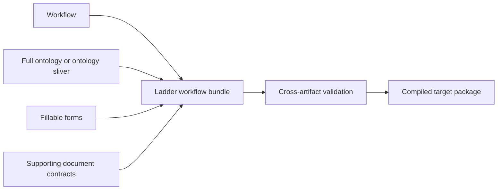

# Ladder Graph feature expansion: workflows, ontologies, forms, and documents

**Decision:** Expand Ladder Graph into a visual compiler for **workflow bundles**. A bundle combines a workflow with an optional full ontology or workflow-specific ontology sliver, plus the forms and supporting document contracts the workflow needs.

**Recommendation strength:** Strong for workflow bundles and first-class forms; moderate for ontology authoring; low for importing any Lattice capability beyond the ontology artifact.

> **Suggested product promise:** Design the workflow, attach its domain meaning and human inputs, and compile the complete package.

## Clarified product boundary

The intended scope is:

- **From Lattice:** import only the ontology—entities, properties, relationships, types, constraints, identifiers, labels, and source metadata needed for portability.
- **Not from Lattice:** do not import its context compiler, evidence system, policy engine, governance workflow, source bindings, runtime, releases, or other application behavior.
- **From DocuBricks:** use the industry schema library, explicitly distinguishing fillable forms from documents that are not forms.
- **In Ladder Graph:** make forms the main new product value. Documents are useful supporting inputs and contracts, while forms become the first-class human interaction layer connected to workflows.
- **Bundle model:** a workflow can remain standalone or be compiled with a full ontology, an ontology sliver, forms, and supporting documents.

This is a materially cleaner product than merging three applications. Ladder Graph remains the compiler and authoring environment; Lattice and DocuBricks are content sources.



## Executive verdict

There is strong value in the expansion, but the value is unevenly distributed:

1. **Forms provide the strongest incremental value.** They give people a concrete way to start workflows, supply structured inputs, review agent output, approve decisions, correct extracted information, and complete human tasks.
2. **Ontology makes workflows more reusable and reliable.** It replaces prompt-local terminology and duplicated schemas with stable domain concepts and relationships.
3. **Ontology slivers make the value practical.** Most workflows do not need an entire industry ontology. A compiler-generated subset keeps bundles understandable, portable, and efficient.
4. **The document library adds domain coverage but is secondary to forms.** Documents can define evidence and extraction contracts without implying that each document is an interactive form.
5. **The current Ladder architecture fits the compiler role.** Canonical YAML, semantic validation, stable diagnostics, source hashing, target adapters, the local catalog, and MCP discovery are reusable across bundle assets.
6. **The existing content creates an unusually strong starting position.** Ladder already has 93 workflows and 307 agent templates across 45 areas. DocuBricks has 55 implemented industry document schemas with 1,043 fields across seven verticals. The inspected Lattice-generated ontology report contains nine industry ontologies totaling 89 entity types and 92 relationships.

The recommendation is therefore not “add an ontology tab and a form tab.” It is:

> Make workflows the center, make forms the primary expansion experience, and make ontology the typed context that binds the bundle together.

## Repository findings that shape the product

### Ladder Graph already contains the beginnings of bundles

Every bundled workflow currently contains at least one input or output schema. Across the catalog there are 922 nodes and 977 edges. Those node-local schemas already describe pieces of forms and domain models, but the concepts are embedded independently in each workflow.

The expansion can eliminate that duplication:

- workflow inputs can reference form output contracts;
- workflow nodes can reference ontology types and properties;
- workflow approvals can reference a decision form;
- workflow outputs can reference a review or completion form;
- repeated node schemas can be generated from shared form and ontology definitions.

### DocuBricks contains both forms and non-form documents

The 55 inspected DocuBricks schema bundles include structured fields, sections, validation rules, confidence thresholds, model routing, extraction output contracts, prompts, and golden fixtures. Examples range from applications and notices to agreements, reports, statements, and certificates.

These assets should not all be treated as visual forms. Ladder needs an explicit classification:

| Asset kind | Meaning in Ladder | Default experience |
| --- | --- | --- |
| `form` | A person enters, reviews, corrects, or approves structured information | First-class visual form builder and preview |
| `document` | A document supplies information to be extracted or validated | Schema/contract inspector and workflow input |
| `hybrid` | A source document is extracted and then reviewed or completed by a person | Document viewer plus generated review form |

The classification should be stored as metadata, not inferred permanently from filenames such as `application`, `report`, or `statement`. Name-based inference can offer a draft suggestion, but a curator should confirm it.

### Lattice should contribute portable ontology data only

The ontology source provides the domain model Ladder needs:

- entity or concept types;
- typed properties and enumerations;
- relationships and cardinality;
- identifiers and required properties;
- descriptions and aliases;
- ontology version, source digest, and provenance;
- optional layout coordinates when useful.

Ladder should normalize this into its own portable ontology input contract. It should not depend on Lattice runtime behavior or copy unrelated Lattice semantics into bundle compilation.

The inspected generated report is still valuable evidence: nine ontologies are already derived from 74 source schemas and 1,420 fields, with 1,201 fields mapped and 219 left visibly unmapped. That 84.6% overall mapping rate proves that automated ontology construction supplies leverage but cannot replace review.

## Product model

### 1. Workflow remains the primary artifact

Existing LGIR workflows remain valid and compilable without any new dependencies. This preserves Ladder's current product, onboarding, and portability.

A workflow opts into bundle features through explicit references:

- `ontologyRef` for a full ontology;
- `ontologySelection` for a compiler-derived or manually curated sliver;
- `formRefs` for interactive inputs, reviews, approvals, and outputs;
- `documentRefs` for extraction or evidence contracts;
- `bindings` that connect fields, ontology properties, and workflow paths.

### 2. Ontology is optional and can be full or sliced

Two modes are valuable:

- **Full ontology:** appropriate for exploratory, reusable, or broad workflows that genuinely operate across the domain.
- **Ontology sliver:** the minimal self-contained subset needed by one workflow and its forms/documents.

A sliver should contain:

- every ontology type explicitly referenced by the workflow;
- every property bound to a workflow or form field;
- every relationship traversed or required by a condition;
- relevant enumerations, constraints, identifiers, and inherited types;
- required dependency types needed to preserve meaning;
- source ontology ID, version, digest, and selection rule.

A sliver is not an informal copy. It is a compiled artifact with traceability back to the full ontology.

### 3. Form is a first-class Ladder language

A canonical Ladder form document should own:

- metadata, version, and intended workflow role;
- pages or steps;
- sections and layout;
- fields and widgets;
- data types and enumerations;
- required, range, format, and cross-field validation;
- conditional visibility and enablement;
- calculated or derived display values;
- help text and evidence instructions;
- accessibility labels and error messages;
- exact submission contract;
- ontology-property bindings;
- workflow input/output bindings.

Forms should compile independently and as part of a workflow bundle.

### 4. Document is a supporting contract

A document asset can retain the useful DocuBricks semantics without pretending to be an interactive form:

- expected document type;
- extraction fields and sections;
- validation rules;
- confidence and review thresholds;
- model-routing hints;
- expected output contract;
- test fixtures and schema version.

A hybrid document can generate a review form from its extraction contract, but the generated form must remain a separate artifact with explicit presentation and interaction semantics.

### 5. Workflow bundle is the compilation unit

The bundle manifest should connect the assets without embedding hidden application state.

```yaml
apiVersion: ladder.dev/v1alpha1
kind: WorkflowBundle
metadata:
  name: insurance-claim-review
spec:
  workflowRef: ladder://workflows/user/claim-review
  ontology:
    ref: ladder://ontologies/builtin/insurance
    mode: sliver
  forms:
    - ref: ladder://forms/builtin/first-notice-of-loss
      role: start
    - ref: ladder://forms/user/claim-decision
      role: approval
  documents:
    - ref: ladder://documents/builtin/claim-file
  bindings: []
```

The compiler should produce a lockfile containing the exact version and digest of every source.

## Why forms are the main value

Ontology improves correctness, but forms make the expansion visible and usable.

Forms add value at every human boundary:

- **Start:** collect the structured information needed to launch a workflow.
- **Clarify:** ask for missing or ambiguous information during a workflow.
- **Review:** present extracted or agent-generated fields for correction.
- **Approve:** record a bounded human decision with required rationale.
- **Exception:** collect escalation details when a condition fails.
- **Complete:** present results and capture disposition or acknowledgment.

This is more valuable than a generic form builder because the form is compiled with the workflow and ontology:

- the ontology supplies types, labels, enumerations, and constraints;
- the form supplies presentation and human interaction;
- the workflow supplies timing, purpose, and downstream use;
- compilation proves that their contracts agree.

The key interaction is not “add a text field.” It is:

> Add a domain field to this workflow step.

That action can create a form control already bound to an ontology property and workflow path, with inherited type and validation.

## UX recommendation

### Keep the workflow at the center

The workflow canvas should show bundle dependencies without turning every form field or ontology type into a task node.

Recommended additions:

- a Bundle panel listing ontology, forms, and documents;
- badges on nodes with bound forms or domain types;
- a human-step action to create or attach a form;
- an input/output action to attach a document contract;
- a domain-binding inspector for workflow paths;
- bundle-level diagnostics and compilation.

### Build forms as a genuinely new first-class experience

The form studio should reuse Ladder's shell, source synchronization, diagnostics, local persistence, compiler controls, and design language, but not the workflow graph canvas.

Recommended workspace:

- left: form structure and domain-field palette;
- center: page/section layout canvas;
- right: field, validation, binding, and accessibility inspector;
- preview: desktop and narrow-width interactive preview;
- source: canonical form YAML or JSON;
- data: exact example and submission payload;
- diagnostics: local form issues plus workflow/ontology mismatches.

### Adapt the graph UI for ontology inspection and bounded editing

Ladder can reuse its graph technology for ontology relationships, but it should keep the experience narrow:

- import a portable ontology snapshot;
- browse and search concepts, properties, and relationships;
- select the full ontology or create a workflow sliver;
- inspect which workflow nodes and form fields use each element;
- make bounded metadata, property, relationship, and mapping edits;
- show sliver completeness and impact diagnostics.

Large ontologies also need a table/tree view. A graph alone will not scale.

### Treat non-form documents as a library, not another visual builder

Document assets primarily need search, schema inspection, test status, workflow attachment, and optional review-form generation. They do not require a page-layout experience unless the asset is explicitly promoted to `form` or `hybrid`.

## Compiler architecture

The right implementation is a multi-artifact compiler with separate semantic modules:

1. **Workflow compiler:** existing LGIR parsing, normalization, validation, and target adapters.
2. **Ontology compiler:** import/normalize, reference validation, sliver closure, target capability reporting, and export.
3. **Form compiler:** layout and field validation, ontology bindings, workflow bindings, accessibility diagnostics, and target generation.
4. **Document-contract compiler:** schema validation, extraction-output validation, rule safety, and fixture metadata.
5. **Bundle compiler:** reference resolution, cross-artifact validation, lockfile creation, and multi-file output.

Do not combine all artifacts into LGIR. Share compiler infrastructure and diagnostic contracts while keeping separate source languages.

### High-value cross-artifact diagnostics

- `ONT201`: ontology sliver omits a relationship required by the workflow.
- `ONT214`: referenced property is missing from the selected ontology version.
- `FORM301`: field widget cannot represent its bound ontology data type.
- `FORM318`: required workflow input is absent from the start form.
- `FORM327`: approval step has no decision or rationale field.
- `DOC401`: document extraction output does not satisfy the workflow input contract.
- `BND501`: form field, ontology property, and workflow path disagree on type.
- `BND512`: bundle dependency digest differs from the locked version.
- `TGT601`: selected target cannot preserve a form rule or ontology constraint.

### Output targets

Initial useful targets are:

- existing Codex, Claude, Hermes, Python, and TypeScript workflow artifacts;
- JSON Schema for form data and workflow contracts;
- a portable Ladder form schema plus UI schema;
- a safe local preview renderer;
- ontology JSON plus optional Turtle/RDF export;
- a multi-file bundle containing manifest, lockfile, sources, compiled output, and diagnostics.

Standalone HTML or React form generation may be valuable later, but only after the canonical form semantics and accessibility contract are stable.

## Value scorecard

| Expansion | User value | Differentiation | Risk | Recommendation |
| --- | ---: | ---: | ---: | --- |
| Workflow-only Ladder | High | Moderate | Low | Preserve |
| Workflow + full ontology | High for broad domain use | Moderate | Medium | Support |
| Workflow + ontology sliver | Very high | High | Medium | Prioritize |
| Standalone ontology editor | Moderate | Low | High | Keep bounded |
| Generic form builder | High but crowded | Low | High | Avoid generic positioning |
| Workflow-bound, ontology-bound forms | Very high | High | Medium-high | Primary expansion bet |
| Non-form document library | Moderate supporting value | Moderate through industry depth | Medium | Include as secondary asset type |
| Workflow bundle compiler | Very high | High | Medium | Strategic center |
| Import Lattice runtime/governance features | Low for this goal | Low | Very high | Out of scope |

## Recommended pilot: insurance claim review

Insurance offers the cleanest three-layer proof:

- DocuBricks has eight insurance document schemas and 122 fields, including form-like assets such as First Notice of Loss and Insurance Policy Application.
- The inspected insurance ontology contains seven entities and six relationships, with 82.8% of source fields mapped.
- Ladder already includes `Blind dual claim review + discordance resolution` and `Alert triage + investigation routing` workflows.

Pilot bundle:

1. Use First Notice of Loss as a start form.
2. Use claim-file or related document contracts as supporting evidence inputs.
3. Import the insurance ontology and compile a claim-review sliver.
4. Bind form fields and extracted fields to ontology properties.
5. Bind the result to the existing claim-review workflow.
6. Add a decision/discordance form for the approval or resolution step.
7. Compile the locked bundle to one current Ladder target and one portable form target.

This pilot tests the core promise without requiring a generic ontology product or every document type to become a form.

## Risks and mitigations

### Forms and documents are conflated

If every schema becomes a visual form, the UI and product language will be misleading.

**Mitigation:** require an explicit `form`, `document`, or `hybrid` classification and preserve the original contract.

### Ontology slivers lose meaning

A naive subset can omit inherited types, relationship endpoints, constraints, or identifiers.

**Mitigation:** define deterministic closure rules, record the source digest and selection rule, and block compilation when meaning cannot be preserved.

### The form builder becomes a commodity feature

Competing on layout widgets alone provides little differentiation.

**Mitigation:** lead with workflow timing, ontology binding, domain libraries, diagnostics, and compiled portability.

### Runtime expectations expand

Users may expect Ladder to host submissions, identity, storage, extraction, and workflow execution.

**Mitigation:** keep preview and compilation separate from execution. Every target must state the required host responsibilities.

### Industry content appears authoritative

Forms and ontologies may encode incomplete, outdated, or jurisdiction-specific assumptions.

**Mitigation:** retain provenance, effective date, jurisdiction, review status, version, and professional-review warnings in every bundle.

### Scope expands across four editors

Workflow, ontology, form, and document experiences can each consume a full roadmap.

**Mitigation:** keep workflow central, make forms first-class, keep ontology editing bounded, and make documents primarily library assets.

## Recommended sequence

### Stage 0 — Classify and normalize the source collections

- Define portable Ontology, Form, Document, and Workflow Bundle contracts.
- Classify DocuBricks assets as form, document, or hybrid through explicit review.
- Define a narrow Lattice ontology export/import boundary.
- Reconcile duplicate or different schema versions across the source repositories.

**Gate:** each pilot asset has one authoritative source, stable ID, version, digest, and artifact kind.

### Stage 1 — Prove bundle compilation without new visual editors

- Implement full-ontology import and deterministic sliver compilation.
- Import the insurance source assets.
- Bind one start form, one document contract, and one Ladder workflow.
- Add cross-artifact diagnostics and a multi-file output/lockfile.

**Gate:** the bundle catches at least three meaningful mismatches and compiles without manual schema duplication.

### Stage 2 — Build the first-class form studio

- Add page/section layout, domain-bound fields, validation, conditional rules, preview, source, and exact payload inspection.
- Add start, review, approval, exception, and completion form roles.
- Make form creation available directly from a workflow node.

**Gate:** a user can create and compile the insurance start and decision forms without editing raw source.

### Stage 3 — Add ontology sliver visualization and bounded editing

- Add concept search, graph/table inspection, relationship traversal, usage analysis, and sliver previews.
- Show exactly why each ontology element is included.
- Add breaking-change and completeness diagnostics.

**Gate:** a user can explain and safely modify the workflow-specific sliver without navigating the entire source ontology.

### Stage 4 — Expand the domain library

- Add review-form generation for hybrid documents.
- Publish form, document, ontology, and bundle resources through MCP.
- Expand to manufacturing, real estate, or energy only after the insurance bundle proves reuse.
- Add new compile targets based on observed integration demand.

## Validation metrics

**Primary expansion activation:** a user compiles a workflow bundle containing a workflow, at least one form, and either a full ontology or ontology sliver.

Measure:

- time from template selection to valid bundle output;
- percentage of form fields bound to ontology properties;
- percentage of workflow inputs supplied by declared form or document contracts;
- number of duplicated node-local schemas removed;
- number of cross-artifact defects caught before target integration;
- sliver size relative to the full ontology;
- sliver completeness failures caught;
- successful use of the compiled form and workflow artifacts in a host;
- reuse of a form or ontology element across additional workflows.

Suggested pilot thresholds:

- at least 95% of fields required by the claim-review workflow are ontology-bound;
- every workflow input has a named form, document, or host source;
- the sliver includes no unused top-level concepts while preserving every required dependency;
- at least three real source mismatches are found and repaired;
- a second insurance workflow reuses the ontology and at least one form without copying schemas;
- users understand the workflow → form/document → ontology relationship without coaching.

## Final recommendation

Move forward with a precise scope:

> **Ladder Graph should compile workflow bundles. The workflow remains central; forms are the primary new first-class experience; documents are supporting contracts; and Lattice contributes only a portable full ontology or workflow-specific ontology sliver.**

This direction creates more value than three independent editors. It turns the existing content into an integrated system:

- workflows define what happens;
- forms define how people participate;
- documents define supporting evidence and extraction contracts;
- ontologies define what the data means;
- the bundle compiler proves that the parts agree and produces a portable target package.

The immediate product bet should be the insurance bundle, followed by the form studio. Avoid importing Lattice application behavior, avoid forcing every DocuBricks document into a form, and avoid making ontology editing broader than the workflows require.

## Evidence reviewed

### Ladder Graph

- `README.md`
- `ladder-graph-specs.md`
- `ARCHITECTURE.md`
- `src/types.ts`
- `src/store/useStudioStore.ts`
- studio, graph, inspector, palette, output, persistence, catalog, MCP, and compiler sources
- `catalog/manifest.json`
- `public/schema/lgir-v1alpha1.schema.json`

### DocuBricks

- `README.md`
- `BUILD_PLAN.md`
- `Schemas/schema_catalog.json`
- all 55 implemented `fields.json` schemas used for the current counts
- representative field, validation, threshold, routing, prompt, and golden-fixture assets
- schema build, validation, and promotion/evaluation code

### Lattice ontology source

- generated ontology report and generator
- ontology entity, property, and relationship types
- generated industry ontology catalog
- ontology import/export implementation
- ontology graph/editor implementation, used only to understand the available ontology artifact

### Evidence limits

The review did not classify every DocuBricks asset manually as form, document, or hybrid; that classification is a required product-content task. The form counts in DocuBricks and the ontology generator's source-schema counts overlap and should not be added together. The review did not validate every domain or regulatory assertion, deploy the applications, or test a real bundle. The insurance vertical slice remains the necessary proof before committing to the full expansion.
