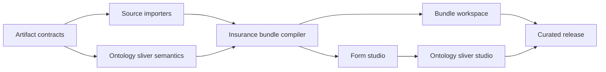

# Ladder Graph workflow-bundle implementation plan

**Status:** The release scope is implemented: reusable bundle assembly, seven curated industry bundles, standalone forms/documents/ontologies, node-level form attachment and creation, the full DocuBricks library, ontology-only Lattice imports, and catalog/MCP support for every artifact kind.

**Companion strategy:** `ladder-graph-feature-expansion.md`

**Primary pilot:** Insurance claim review

**Planning principle:** Preserve the existing workflow product while adding bundles incrementally.

### Implementation checkpoint — 2026-08-17

Implemented in the first vertical slice:

- all four portable artifact contracts and JSON Schemas;
- TypeScript and Rust artifact analysis plus Wasm entry points;
- deterministic ontology sliver compilation with inclusion reasons;
- portable Lattice ontology and classified DocuBricks importers;
- cross-artifact validation, multi-file compilation, and lockfiles;
- curated insurance ontology, forms, document contract, bundle, and classification fixtures;
- Dexie v3 storage migration primitives;
- an experimental bundle map, embedded read-only workflow graph with node/edge inspection, form preview, ontology relationship canvas, and output browser;
- a first-class structural form studio with outline, canvas, inspector, ontology palette, responsive preview, source synchronization, diagnostics, undo/redo, and portable exports;
- edited form sources flowing back into bundle validation and deterministic compilation;
- general bundle assembly across the workflow catalog, attach/remove asset controls, and a visual binding inspector;
- bundle project persistence, complete-asset revisions, history restore, Recent Projects reopening, and SHA-256-verified `.ladderbundle.json` import/export;
- a reproducible bulk importer and reviewed classification for all 55 usable DocuBricks schemas, producing 24 forms, 31 documents, 1,043 fields, source digests, and a conversion report;
- searchable and industry-filtered ontology/form/document starter selection in the bundle workspace;
- unit, browser, build, and Rust-workspace verification.

Completed in the feature-expansion release:

- reproducible ontology-only imports from Lattice for manufacturing, legal, financial services, energy, healthcare, and real estate, without copying policies, runtime behavior, evidence systems, or other Lattice application concerns;
- curated manufacturing line qualification, legal regulatory-obligations, commercial-credit underwriting, energy field operations, healthcare claims audit, and real-estate valuation bundles in addition to insurance;
- explicit workflow/form/document-to-ontology bindings and deterministic sliver compilation for every curated bundle;
- a first-class bundle gallery, workflow-aware bundle recommendations, and correct reopening of saved bundle projects;
- first-class blank bundle creation with editable identity/version and saved local workflows and artifacts available during assembly;
- standalone, locally persisted form projects backed by the purpose-built visual form studio;
- standalone document contract inspection and ontology type/property exploration with editable portable YAML and compiler diagnostics;
- selectable ontology relationship canvases with type/relationship inspectors in both standalone and bundle workspaces, workflow-sliver impact previews, and guided warnings for removed ontology types, properties, and relationships;
- blank ontology creation plus bounded RDF/XML OWL normalization for named classes, inheritance, datatype properties, and object properties, with an import report for omitted semantics;
- direct catalog-form attachment to workflow nodes and first-class form creation seeded from node schemas;
- a metadata-only startup artifact index with full YAML sources deferred to the artifact workspaces;
- catalog snapshot and MCP discovery/retrieval for workflows, agents, ontologies, forms, documents, and workflow bundles;
- regression coverage for every curated bundle, saved artifact routing, standalone artifact persistence, and the production build path used by Vercel.

Future product work, outside the completed compiler expansion:

- advanced large-ontology clustering, progressive rendering, and automated migration rewriting beyond the current relationship canvas and breaking-change guidance;
- hosted form submission, identity, case management, and runtime execution remain deliberately outside Ladder Graph's compiler boundary.

## 1. Outcome

Build Ladder Graph into a visual compiler for workflow bundles.

A bundle can contain:

- one existing LGIR workflow;
- zero or one imported ontology;
- either the full ontology or a deterministic workflow-specific ontology sliver;
- zero or more first-class forms;
- zero or more supporting document contracts;
- explicit bindings connecting workflow paths, form/document fields, and ontology properties;
- a lockfile and compiled target artifacts.

The first production proof is an insurance claim-review bundle that combines:

- `Blind dual claim review + discordance resolution`;
- a First Notice of Loss start form;
- a claim-file supporting document contract;
- an imported insurance ontology sliver;
- a claim decision or discordance-resolution form;
- one existing Ladder workflow target;
- one portable form target.

## 2. Product boundaries

### In scope

- Import portable ontology data originating from Lattice.
- Normalize ontology entities, properties, relationships, cardinality, constraints, identifiers, labels, versions, digests, and provenance.
- Import DocuBricks schemas and classify each as `form`, `document`, or `hybrid`.
- Create a first-class Ladder form language and form studio.
- Preserve non-form documents as supporting contracts.
- Compile full ontologies or deterministic ontology slivers with workflows.
- Validate bindings across workflows, forms, documents, and ontologies.
- Produce multi-file bundles with deterministic lockfiles.
- Expose the new artifact kinds through the local catalog and MCP companion.

### Out of scope

- Lattice context compilation, policies, evidence governance, source bindings, assurance, release workflow, identity, or runtime behavior.
- DocuBricks Databricks deployment, extraction runtime, model invocation, prompt execution, or schema-promotion runtime.
- Workflow execution.
- Form submission hosting, authentication, persistent response storage, or case management.
- Full OWL reasoning.
- Arbitrary JavaScript, Python, SQL, JSONata, or user-supplied expression execution.
- Treating every DocuBricks document as a form.
- Replacing LGIR or breaking existing workflow files, targets, or MCP tools.

## 3. Decisions to lock before implementation

These defaults are recommended for the first vertical slice.

| Decision | Recommended choice | Reason |
| --- | --- | --- |
| Canonical source | YAML for all Ladder-authored artifacts | Matches LGIR, source editor, import/export, and CST patching |
| Source ownership | Ladder stores normalized snapshots with source metadata | Preserves offline compilation and reproducibility |
| Lattice integration | Portable ontology JSON/YAML import only | Prevents runtime and application coupling |
| DocuBricks integration | Build-time/manual snapshot importer | Avoids runtime filesystem and repository dependencies |
| Sliver selection | Explicit seeds plus deterministic dependency closure | Avoids guessing from prompts or labels |
| Form MVP target | Portable Ladder form schema, JSON Schema, UI schema, and local preview | Proves semantics before framework-specific codegen |
| Bundle output | Multi-file artifact array plus downloadable archive | The current one-string compile result cannot represent a bundle |
| Existing workflow API | Leave unchanged | Backward compatibility and low regression risk |
| Document rules | Translate a safe subset; preserve unsupported source rules as inert metadata | Maintains Ladder's no-code-execution security boundary |
| Feature rollout | Experimental bundle workspace until the insurance gate passes | Keeps the current primary journey stable |

## 4. Artifact model

Add four independent document kinds. Do not overload `Workflow` or add form/ontology behavior as LGIR node kinds.

### 4.1 Ontology

```yaml
apiVersion: ladder.dev/v1alpha1
kind: Ontology
metadata:
  name: insurance
  title: Insurance
  version: 1.0.0
  source:
    system: lattice
    sourceId: insurance-ontology
    sourceVersion: 1.0.0
    sourceDigest: sha256:...
spec:
  types: []
  relationships: []
```

Minimum type model:

- stable ID, label, description, aliases;
- optional parent type IDs;
- properties with stable IDs, data types, required state, identifier state, allowed values, unit, and description;
- optional source paths and provenance metadata.

Minimum relationship model:

- stable ID, label, description;
- source type ID and target type ID;
- one-to-one, one-to-many, many-to-one, or many-to-many cardinality;
- optional inverse relationship ID;
- optional required state and provenance metadata.

Do not put Lattice policies, governed operations, evidence records, bindings, runtime entities, or compiler plans into this document.

### 4.2 Form

```yaml
apiVersion: ladder.dev/v1alpha1
kind: Form
metadata:
  name: first-notice-of-loss
  title: First Notice of Loss
  version: 1.0.0
spec:
  role: start
  pages: []
  submissionSchema: {}
```

MVP form roles:

- `start`;
- `clarification`;
- `review`;
- `approval`;
- `exception`;
- `completion`.

MVP field model:

- ID, name, label, description, help text;
- data type and widget;
- required state and default value;
- allowed values;
- format, range, length, and safe cross-field validation;
- ontology-property reference;
- workflow source or target path;
- accessibility label and error message;
- visibility and enablement rules from a bounded declarative operator set.

MVP layout model:

- ordered pages;
- ordered sections;
- one- or two-column responsive grid;
- field spans;
- headings, explanatory text, and dividers;
- no absolute positioning.

### 4.3 Document

```yaml
apiVersion: ladder.dev/v1alpha1
kind: Document
metadata:
  name: insurance-claim-file
  title: Insurance Claim File
  version: 1.0.0
  source:
    system: docubricks
    sourcePath: Schemas/insurance/insurance_claim_file
spec:
  documentType: insurance_claim_file
  sections: []
  fields: []
  validationRules: []
  reviewPolicy: {}
  outputSchema: {}
```

The importer may preserve DocuBricks prompt and model-routing identifiers as inert metadata, but Ladder must not execute them.

Supported rule conversion in the first slice:

- presence/required;
- numeric minimum and maximum;
- string length;
- allowed value;
- date ordering;
- field equality/inequality;
- boolean combinations with bounded depth.

Unsupported SQL-like expressions remain visible source metadata and generate a target-capability warning.

### 4.4 WorkflowBundle

```yaml
apiVersion: ladder.dev/v1alpha1
kind: WorkflowBundle
metadata:
  name: insurance-claim-review
  title: Insurance claim review
  version: 1.0.0
spec:
  workflowRef: ladder://workflows/builtin/wf-insr-01
  ontology:
    ref: ladder://ontologies/builtin/insurance
    mode: sliver
    selection:
      typeIds: []
      propertyRefs: []
      relationshipIds: []
  forms: []
  documents: []
  bindings: []
```

Binding model:

- source artifact URI and JSON Pointer;
- target artifact URI and JSON Pointer;
- optional ontology property reference;
- direction: `input`, `output`, `review`, or `approval`;
- optional transform limited to the existing safe declarative transform set;
- stable binding ID and description.

## 5. Ontology sliver semantics

Sliver compilation must be deterministic and must not infer requirements from natural-language prompts.

### Seed set

Collect explicit references from:

- bundle ontology selection;
- bundle bindings;
- form ontology-property bindings;
- document field mappings;
- structured workflow input/output schemas with ontology annotations;
- structured workflow node configuration added specifically for ontology references.

### Dependency closure

For each seed, include:

1. The referenced type or property.
2. The owning type of every included property.
3. Both endpoint types of every included relationship.
4. All ancestor types required to preserve inherited properties or constraints.
5. All enumerations, units, identifiers, and constraints referenced by included properties.
6. Relationships explicitly traversed by bindings or structured workflow configuration.
7. Any additional type required by a mandatory relationship constraint.

Do not include:

- concepts mentioned only in prompts or descriptions;
- unrelated sibling or descendant types;
- runtime entities or records;
- Lattice-only governance fields;
- unused visual layout metadata, except positions for included types when requested.

### Sliver result

Emit:

- normalized ontology YAML/JSON;
- source ontology ID, version, and digest;
- deterministic selection digest;
- sorted included type, property, and relationship IDs;
- an inclusion-reason map;
- diagnostics for unresolved references or incomplete closure;
- source-to-sliver mapping metadata.

Compilation must fail if a sliver cannot preserve required type, relationship, identifier, or constraint semantics.

## 6. Repository architecture

### 6.1 Rust core

Keep `crates/lgir-core` focused on existing workflow semantics.

Add:

```text
crates/ladder-artifacts/
  Cargo.toml
  src/
    lib.rs
    parse.rs
    security.rs
    diagnostic.rs
    ontology.rs
    ontology_slice.rs
    form.rs
    document.rs
    bundle.rs
    compile.rs
```

`ladder-artifacts` should depend on `lgir-core` for workflow analysis and compilation. `lgir-core` should not depend on the new crate.

Update `crates/lgir-wasm` to expose separate functions:

- `analyze_artifact(source, target?)`;
- `format_artifact(source)`;
- `compile_bundle(source, resolved_assets_json, target)`;
- `slice_ontology(ontology_source, selection_json)`.

Keep the current `analyze`, `format`, `compile`, and `migrate` exports unchanged.

### 6.2 Browser compiler

Add new operations without changing existing ones:

```ts
type ArtifactOperation =
  | "analyzeArtifact"
  | "formatArtifact"
  | "compileBundle"
  | "sliceOntology";
```

Suggested files:

```text
src/compiler/artifacts/types.ts
src/compiler/artifacts/fallback.ts
src/compiler/artifacts/ontology.ts
src/compiler/artifacts/form.ts
src/compiler/artifacts/document.ts
src/compiler/artifacts/bundle.ts
```

The TypeScript fallback must remain semantically aligned with Rust/Wasm for all supported rules. Parity tests are release-blocking.

### 6.3 TypeScript types

Split the current monolithic type surface:

```text
src/types/workflow.ts
src/types/ontology.ts
src/types/form.ts
src/types/document.ts
src/types/bundle.ts
src/types/compiler.ts
src/types/catalog.ts
src/types.ts              # compatibility re-exports
```

Keep existing imports working through `src/types.ts` during the migration.

Add a multi-file compile result without altering `CompileResult`:

```ts
interface CompiledArtifact {
  path: string;
  mimeType: string;
  content: string;
  sourceHash: string;
}

interface BundleCompileResult {
  ok: boolean;
  artifacts: CompiledArtifact[];
  lockfile: BundleLockfile | null;
  diagnostics: Diagnostic[];
  capabilityReport: BundleCapabilityReport;
}
```

### 6.4 Portable schemas

Add:

```text
public/schema/ontology-v1alpha1.schema.json
public/schema/form-v1alpha1.schema.json
public/schema/document-v1alpha1.schema.json
public/schema/workflow-bundle-v1alpha1.schema.json
public/schema/bundle-lock-v1.schema.json
```

Rust remains the semantic authority; the JSON Schemas remain portable authoring contracts.

### 6.5 Catalog

Extend catalog kinds:

- `workflow`;
- `agent-template`;
- `ontology`;
- `form`;
- `document`;
- `workflow-bundle`.

Recommended layout:

```text
catalog/
  workflows/
  agents/
  ontologies/
  forms/
  documents/
  bundles/
  imports/
    docubricks-classification.yaml
  manifest.json
```

Update `scripts/generate-catalog-index.mjs` to validate all listed files and generate separate typed arrays. Do not load full fixture bodies into the initial gallery bundle when lazy loading is available.

Introduce `catalog-snapshot-v2` for the expanded kind set. Continue accepting v1 user snapshots and migrate them as workflow/agent entries.

### 6.6 Persistence

Use a Dexie version 3 migration.

Recommended model:

- keep existing `projects` records readable;
- add `artifactKind` with a default of `workflow`;
- make target optional for non-workflow artifacts;
- add a `bundleAssets` table for locally resolved snapshots and digests;
- keep revisions keyed by project ID;
- preserve every existing workflow project and revision.

Do not rename the IndexedDB database or require users to export/re-import existing work.

### 6.7 MCP companion

Add resources and read-only tools only after the local catalog is stable:

- `get_ontology`;
- `get_form`;
- `get_document`;
- `get_workflow_bundle`;
- `validate_workflow_bundle`;
- `compile_workflow_bundle`.

Keep current workflow tools and URIs unchanged.

## 7. Source import pipelines

### 7.1 Lattice ontology importer

Preferred boundary: consume an exported portable ontology JSON/YAML file, not Lattice source code or runtime packages.

Add:

```text
scripts/import-lattice-ontologies.mjs
```

Inputs:

- one ontology export file or directory;
- optional source label and license/provenance metadata;
- explicit destination IDs.

Outputs:

- normalized Ladder ontology YAML;
- import report with omitted fields and warnings;
- deterministic source digest;
- optional layout coordinates for included types.

The importer must fail on duplicate IDs, dangling relationships, unsupported data types without a declared fallback, and unknown mandatory constraints.

### 7.2 DocuBricks importer

**Implemented:** `scripts/import-docubricks-library.mjs` consumes the reviewed 55-entry classification, emits normalized catalog YAML and manifest entries, and writes `catalog/imports/docubricks-import-report.json`. The snapshot currently contains 24 primary form experiences and 31 document contracts. Hybrid source assets have an explicit primary experience. All 1,043 fields are retained; supported rules become declarative rules and unsupported expressions remain inert metadata.

Add:

```text
scripts/import-docubricks-library.mjs
catalog/imports/docubricks-classification.yaml
```

The classification file is the reviewed source of truth for:

- artifact kind: `form`, `document`, or `hybrid`;
- Ladder artifact ID and title;
- included source files;
- intended form role when applicable;
- jurisdiction/effective-date/review metadata;
- import overrides and field mappings.

Importer outputs:

- normalized form or document YAML;
- conversion report;
- supported and unsupported validation rules;
- source digest and file list;
- optional form-layout starter generated from sections;
- catalog manifest entries.

Never execute prompt content, SQL-like validation expressions, or model-routing configuration during import or compilation.

## 8. User experience plan

### 8.1 Bundle workspace MVP

Add a Bundle panel to the existing workflow studio before creating new full editors.

Capabilities:

- create a bundle from the current workflow;
- attach ontology, form, and document assets;
- choose `full` or `sliver` ontology mode;
- see unresolved and incompatible references;
- inspect dependency digests;
- compile/download the bundle;
- open an attached asset in its appropriate editor.

Suggested components:

```text
src/components/bundle/BundlePanel.tsx
src/components/bundle/BundleAssetPicker.tsx
src/components/bundle/BindingInspector.tsx
src/components/bundle/BundleDiagnostics.tsx
src/components/bundle/BundleOutputPanel.tsx
```

### 8.2 Form studio MVP

Build as a sibling surface, not conditionals spread through `Studio.tsx`.

Suggested components:

```text
src/components/form/FormStudio.tsx
src/components/form/FormHeader.tsx
src/components/form/FormOutline.tsx
src/components/form/FormCanvas.tsx
src/components/form/FormInspector.tsx
src/components/form/FormPreview.tsx
src/components/form/FormSourceEditor.tsx
src/components/form/FormDiagnostics.tsx
src/store/useFormStore.ts
```

MVP authoring:

- add, reorder, duplicate, and delete pages, sections, and fields;
- add a field from the ontology palette;
- edit labels, help, required state, widget, enum, and safe validation;
- bind a field to a workflow path;
- preview narrow and desktop layouts;
- verify keyboard, focus, labels, errors, and 200% zoom behavior;
- import a DocuBricks-derived starter;
- compile/download portable schema artifacts.

### 8.3 Ontology studio MVP

Use the existing graph library but do not clone workflow task semantics.

Suggested components:

```text
src/components/ontology/OntologyStudio.tsx
src/components/ontology/OntologyGraph.tsx
src/components/ontology/OntologyTree.tsx
src/components/ontology/OntologyInspector.tsx
src/components/ontology/SliverPanel.tsx
src/components/ontology/UsagePanel.tsx
src/store/useOntologyStore.ts
```

MVP capabilities:

- import and browse an ontology;
- search types, properties, and relationships;
- graph and table/tree views;
- display workflow/form/document usage;
- choose seeds and preview deterministic closure;
- show why each sliver item is included;
- bounded edits to labels, descriptions, properties, relationships, and mappings;
- export full ontology or sliver.

### 8.4 Gallery and navigation

Keep the existing workflow gallery default.

Add secondary library filters for:

- workflows;
- bundles;
- forms;
- documents;
- ontologies.

Outcome-led bundles should appear only after the insurance vertical passes its release gate.

## 9. Milestones

### Milestone 0 — Contract RFC and fixtures

**Relative effort:** Medium

**User-visible:** No

Deliver:

- four JSON Schemas and TypeScript/Rust models;
- diagnostic namespaces and error-code registry;
- insurance source fixtures;
- reviewed DocuBricks classification for the pilot;
- portable insurance ontology fixture;
- approved sliver closure rules;
- compatibility and security test vectors.

Gate:

- the same fixtures parse in Rust and TypeScript;
- existing workflow tests remain unchanged and green;
- every pilot reference is stable and versioned.

### Milestone 1 — Artifact core and importers

**Relative effort:** Large

**User-visible:** Source/import only

Deliver:

- `ladder-artifacts` crate;
- Wasm and fallback operations;
- ontology and DocuBricks importers;
- artifact analysis/formatting;
- sliver compiler;
- catalog generation for new kinds.

Gate:

- repeated import and sliver compilation are byte-identical;
- unsupported source semantics are diagnosed, never dropped silently;
- the insurance ontology and selected DocuBricks assets import without error.

### Milestone 2 — Bundle compiler and insurance vertical slice

**Relative effort:** Large

**User-visible:** Experimental bundle compilation

Deliver:

- bundle resolver and lockfile;
- cross-artifact validator;
- multi-file compile result;
- insurance start form source;
- claim document contract;
- claim-review ontology sliver;
- existing claim-review workflow binding;
- decision form source;
- downloadable bundle.

Gate:

- catches at least three real cross-source mismatches;
- every workflow input has a declared source;
- at least 95% of workflow-required form/document fields are ontology-bound;
- compilation preserves the current workflow artifact byte-for-byte when bundle additions are removed;
- the output can be consumed by one small reference host without schema rewriting.

### Milestone 3 — Bundle workspace

**Status:** Complete for the browser-local experimental workspace, including persistence, complete revision bodies, recovery, and portable archive import/export.

**Relative effort:** Medium

**User-visible:** Yes, experimental

Deliver:

- Bundle panel, asset picker, binding inspector, diagnostics, output browser;
- full/sliver selection;
- local persistence and revision support;
- import/export archive flow.

Gate:

- a user can assemble and compile the insurance bundle without editing the manifest manually;
- invalid-draft recovery works for bundles;
- existing workflow primary journey remains unchanged.

### Milestone 4 — First-class form studio

**Status:** Complete for first-class form authoring, standalone saved form projects, bundle-owned editing, ontology-backed field creation, preview, source synchronization, diagnostics, portable output, and direct workflow-node create/attach shortcuts.

**Relative effort:** Extra large

**User-visible:** Yes

Deliver:

- form builder, preview, source view, inspector, diagnostics, and portable outputs;
- ontology field palette;
- workflow-node attach/create flow;
- DocuBricks form starters;
- accessible form-renderer component.

Gate:

- insurance start and decision forms can be authored without source editing;
- keyboard-only creation and completion paths work;
- generated forms meet the agreed WCAG 2.2 AA checks;
- form output matches the bundle contract exactly.

### Milestone 5 — Ontology sliver studio

**Status:** Complete for the release scope: blank ontology creation, bounded RDF/XML OWL import, searchable relationship canvases, type/property and relationship inspection, canonical source editing, compiler diagnostics, breaking-change guidance, and deterministic bundle sliver selection. Advanced large-graph clustering and automated migration rewriting remain post-release enhancements.

**Relative effort:** Large

**User-visible:** Yes

Deliver:

- graph plus tree/table ontology views;
- usage and inclusion-reason panels;
- sliver preview and bounded edits;
- breaking-change diagnostics;
- full/sliver export.

Gate:

- users can explain why every sliver element exists;
- removing a required dependency is blocked with a precise repair;
- the 1,000-element safety limit and performance budgets remain enforced.

### Milestone 6 — Catalog, MCP, and additional industries

**Status:** Complete. The catalog and MCP expose all six artifact kinds, existing workflow behavior remains compatible, and manufacturing, legal, commercial credit, energy, healthcare, and real estate extend the insurance pilot without new artifact semantics.

**Relative effort:** Large

**User-visible:** Yes

Deliver:

- catalog snapshot v2 migration;
- new MCP resources/tools;
- curated insurance bundle release;
- one second vertical selected from manufacturing, real estate, or energy;
- contributor documentation and import validation.

Gate:

- old MCP clients retain current workflow behavior;
- new artifact retrieval is deterministic and read-only;
- a second vertical reuses the core without new artifact semantics.

## 10. Suggested pull-request sequence

1. Add artifact RFC, schemas, types, diagnostic registry, and fixtures.
2. Add `ladder-artifacts` parsing/security limits with Rust tests.
3. Add TypeScript fallback parsing and Rust/Wasm parity fixtures.
4. Add ontology normalization and deterministic sliver closure.
5. Add Lattice ontology importer and import report.
6. Add form/document normalization and DocuBricks classification/importer.
7. Add bundle resolver, bindings, cross-validation, and lockfile.
8. Add multi-file bundle output and download/archive support.
9. Add insurance bundle source fixtures and reference-host test.
10. Add catalog v2 and browser catalog generation.
11. Add bundle persistence and experimental Bundle panel.
12. Add binding inspector and bundle diagnostics/output UI.
13. Add form store, source editor, and structural authoring.
14. Add form preview, ontology field palette, and workflow attachment.
15. Add ontology store, graph/tree views, usage, and sliver panel.
16. Add MCP resources/tools and end-to-end compatibility tests.

Each PR should leave the current workflow journey releasable.

## 11. Verification plan

### Compiler tests

- parse, normalize, format, and hash every new artifact kind;
- reject unknown kinds and unsupported versions;
- enforce size, nesting, collection, string, and reference limits;
- reject YAML tags, aliases, anchors, and external references under the existing security policy;
- deterministic ontology closure and ordering;
- missing types, properties, endpoints, and bindings;
- safe rule conversion and unsupported-rule warnings;
- exact Rust/Wasm and TypeScript fallback parity;
- deterministic bundle lockfile and artifact paths;
- current workflow compiler snapshot stability.

### Importer tests

- every classified pilot asset imports;
- source file digests are stable;
- duplicate IDs and conflicting fields block import;
- unsupported field types require explicit mapping;
- unsafe rule expressions remain inert;
- repeat imports produce no diff;
- import reports list every omitted or transformed source field.

### UI tests

- bundle creation, attachment, binding, validation, compile, and download;
- form add/reorder/delete/edit/preview/source synchronization;
- ontology import/search/sliver/usage/export;
- invalid-source recovery;
- undo/redo per artifact;
- mobile/narrow layouts;
- 200% zoom;
- keyboard and screen-reader labels;
- visible focus and non-color diagnostics;
- reduced motion.

### End-to-end stories

1. Open the insurance claim-review workflow.
2. Convert it to a bundle.
3. Attach the insurance ontology.
4. Select sliver mode.
5. Attach or create the FNOL start form.
6. Attach the claim-file document contract.
7. Resolve all binding diagnostics.
8. Attach or create the decision form.
9. Compile and inspect all bundle files.
10. Reopen the saved bundle offline and reproduce the same output.

### Performance budgets

- Preserve the current 200-node workflow responsiveness and compiler budget.
- Analyze a form with 500 fields without blocking the UI thread.
- Browse a 1,000-type ontology in scoped/table mode; do not attempt to render every relationship simultaneously.
- Compile a typical ontology sliver and bundle within 500 ms on the CI baseline after assets are locally resolved.
- Keep import-time content generation out of the normal browser startup path.

## 12. Rollout and compatibility

- Ship artifact schemas and compiler support before showing new gallery categories.
- Guard the Bundle panel behind a local experimental setting through Milestone 3.
- Keep standalone workflow compile as the default header action.
- Show `Compile bundle` only when the current workflow has a bundle manifest.
- Read catalog snapshot v1 indefinitely; write v2 only after migration.
- Preserve current workflow URLs, project IDs, exports, target output, and MCP behavior.
- Do not auto-convert existing workflows into bundles.
- Offer explicit extraction of repeated node schemas into a form or ontology only after the form studio is stable.

## 13. Risks and controls

| Risk | Control |
| --- | --- |
| Scope consumes the existing product | Independent crates/stores/surfaces; workflow API remains stable |
| Imported rules execute code | Safe-rule allowlist; raw source retained as inert metadata |
| Sliver silently changes meaning | Deterministic closure, inclusion reasons, source digest, blocking diagnostics |
| Forms become generic and undifferentiated | Prioritize workflow roles, ontology bindings, and domain templates |
| All documents become forms | Required curated `form`/`document`/`hybrid` classification |
| External repos become runtime dependencies | Import normalized snapshots at build/manual import time |
| Bundle files drift | Lockfile with per-asset version and digest |
| Storage migration loses projects | Dexie upgrade tests against v1/v2 fixtures; no database rename |
| Wasm and fallback diverge | Shared fixtures and byte-level parity checks |
| Industry content appears authoritative | Provenance, jurisdiction, effective date, review state, warnings |
| Large ontology graph freezes UI | Scoped views, table/tree fallback, render limits, worker analysis |

## 14. Definition of done for the first release

The feature expansion is ready for a first release when:

- existing workflows compile identically to the current release;
- Ontology, Form, Document, and WorkflowBundle schemas are published and versioned;
- the insurance ontology imports from a portable Lattice ontology export;
- pilot DocuBricks assets are explicitly classified and import reproducibly;
- the claim-review ontology sliver is deterministic and explainable;
- users can author the pilot start and decision forms visually;
- users can assemble the insurance bundle without raw manifest editing;
- all cross-artifact diagnostics identify the originating artifact and path;
- the bundle compiles into a deterministic multi-file output and lockfile;
- one reference host consumes the workflow and form contracts without rewriting schemas;
- browser, offline, accessibility, malformed-input, deterministic-output, and storage-migration gates pass;
- documentation clearly separates compilation, preview, and host execution.

## 15. Immediate next actions

1. Approve the four artifact boundaries and the proposed bundle manifest.
2. Create the reviewed DocuBricks insurance classification file.
3. Export the insurance ontology from Lattice in portable JSON/YAML.
4. Select exact source assets for FNOL, claim file, and policy application.
5. Write the five cross-source mismatch fixtures the compiler must catch.
6. Implement Milestone 0 as the first code change.

The critical path is:


