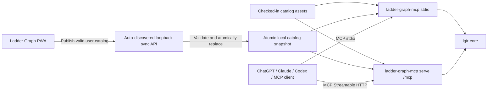

# Native Rust MCP plan for Ladder Graph

Status: implemented
Decision: implement `ladder-graph-mcp` as a native Rust companion; keep WebAssembly only for the existing browser compiler and any future untrusted plugin boundary.

## Outcome

When Ladder Graph is running, a user can explicitly publish their current workflow library to a local companion. ChatGPT, Claude, Codex, and other MCP clients can then discover and retrieve:

- built-in Ladder Graph workflows;
- user-customized workflows;
- built-in agent templates;
- user-customized agent templates;
- raw LGIR YAML, normalized YAML, JSON, Markdown, or a supported compiled target.

The integration is local-first and read-only from MCP in the initial release. Users no longer copy and paste workflow YAML into chat.

## Architectural decision

Use the official Rust MCP SDK (`rmcp`) and the current MCP protocol. The server supports stdio first and Streamable HTTP after the local security and authorization model is complete.

The native server reuses the existing Rust compiler directly. It does not embed a WASM runtime and does not attempt to read browser IndexedDB or OPFS. Instead, Ladder Graph publishes a versioned catalog snapshot through an authenticated loopback synchronization endpoint.



### Source-of-truth boundaries

- LGIR YAML remains the canonical workflow format.
- The PWA remains authoritative for browser-owned user projects and custom templates.
- Checked-in catalog files remain authoritative for built-in workflows and agents.
- The native snapshot is a published read model, not a second editor or bidirectional database.
- `lgir-core` remains authoritative for parsing, validation, normalization, migration, hashing, and compilation.

## Proposed repository structure

```text
catalog/
  manifest.json
  workflows/*.yaml
  agents/*.yaml
crates/
  lgir-core/                 # pure native Rust domain/compiler library
  lgir-wasm/                 # wasm-bindgen JSON facade used by the PWA
  ladder-catalog/            # catalog records, formats, indexing, snapshots
  ladder-graph-mcp/          # MCP server binary and loopback sync service
src/
  generated/catalog.ts       # generated browser index, not a second source of truth
```

Refactor the current `lgir-core` crate so its domain functions return typed Rust results. Move the `#[wasm_bindgen]` string-returning facade into `lgir-wasm`. This lets the browser and MCP server call the same compiler without coupling native code to browser bindings.

The active workflow and role-template libraries currently embedded in TypeScript should move to canonical files under `catalog/`. A build script generates the small TypeScript index used by the PWA. Existing historical JSON catalogs must be inventoried and deduplicated rather than silently exposed as additional agents.

## Catalog contract

Each published entry has stable identity and provenance:

```json
{
  "id": "stable-uuid-or-built-in-id",
  "kind": "workflow",
  "scope": "user",
  "title": "Implementation and risk review",
  "description": "...",
  "version": "1.0.0",
  "tags": ["engineering", "review"],
  "updatedAt": "2026-08-16T12:00:00Z",
  "sourceHash": "sha256:...",
  "mediaType": "application/yaml",
  "content": "apiVersion: ladder.dev/v1alpha1\n..."
}
```

`kind` is `workflow` or `agent-template`; `scope` is `builtin` or `user`. User IDs must not change when a title or YAML metadata name changes.

The published snapshot contains all user records. Publishing a new snapshot replaces the previous user view, so deletion semantics are deterministic and do not require tombstones. The companion validates the entire snapshot before replacement and writes it using a temporary file, flush, and atomic rename. MCP readers therefore see either the previous complete catalog or the next complete catalog.

For workflows with an invalid current draft, the PWA publishes `lastValidYaml` and clearly labels that choice in the UI. Invalid drafts are not exposed as executable-looking resources in v1.

## MCP surface

### Resources

Canonical resources use stable custom URIs:

```text
ladder://workflows/builtin/{id}
ladder://workflows/user/{id}
ladder://agents/builtin/{id}
ladder://agents/user/{id}
```

`resources/list` returns catalog metadata with pagination. `resources/read` returns canonical YAML with `application/yaml`. Resource templates add explicit representations without multiplying the normal listing:

```text
ladder://workflows/{scope}/{id}{?format,target}
ladder://agents/{scope}/{id}{?format}
```

Supported workflow formats:

- `source-yaml`: exact published LGIR;
- `normalized-yaml`: normalized by `lgir-core`;
- `json`: structured LGIR JSON;
- `markdown`: readable workflow documentation;
- `compiled`: requires `target=codex|claude|hermes|python|typescript`.

Supported agent-template formats are `yaml`, `json`, and `markdown`.

Resource annotations should identify user-owned content and the last-modified timestamp. Resource list-change notifications and subscriptions are deferred until basic interoperability is proven; the server reloads the snapshot when its modification time changes before servicing a request.

### Read-only tools

Resources are the primary data model, but tools make the catalog usable in clients that do not offer strong resource discovery UI.

| Tool | Purpose |
| --- | --- |
| `search_catalog` | Search titles, descriptions, tags, roles, and workflow objectives with kind/scope filters. |
| `get_workflow` | Retrieve one workflow by URI or ID in a requested format. |
| `get_agent_template` | Retrieve one agent template by URI or ID in YAML, JSON, or Markdown. |
| `validate_workflow` | Validate supplied YAML or a catalog URI and return structured diagnostics. |
| `compile_workflow` | Compile supplied YAML or a catalog URI to a supported target. |

Search results are summaries containing URI, title, kind, scope, version, update time, and source hash. They do not return every full YAML document. Inputs and outputs use JSON Schema and structured MCP content. Validation and compilation enforce the existing 2 MB source limit and return the same diagnostics and capability report as the PWA.

MCP mutation tools such as `save_workflow`, `update_template`, or `delete_workflow` are explicitly out of scope for v1. Editing remains visible and deliberate inside Ladder Graph.

### Optional prompts

After resources and tools interoperate broadly, expose agent templates as MCP prompts for clients that support prompt selection. Prompts are an ergonomic view over the same catalog entries, never a separate template store.

## Browser-to-native synchronization

The browser cannot safely or portably expose IndexedDB/OPFS to a native process. The companion therefore provides a small loopback API. It starts automatically beside the normal stdio MCP transport, so the user does not run a second process:

```text
GET  /health
POST /api/v1/connect
PUT  /api/v1/catalog/user
POST /mcp                       # Streamable HTTP, when enabled
```

Connection flow:

1. The user configures `ladder-graph-mcp` once in ChatGPT, Claude, Codex, or another desktop MCP client.
2. The client starts the stdio server, which also binds the origin-restricted loopback bridge.
3. Ladder Graph discovers the bridge and presents its anonymous browser installation UUID.
4. The service returns a scoped, revocable sync token; the PWA stores it in origin-scoped browser storage.
5. **Publish to MCP** sends a complete valid user snapshot and shows the count, timestamp, and resulting catalog revision.

The sync service binds only to `127.0.0.1`/`::1`, uses an explicit CORS allowlist, requires the installation token for writes, limits request size, and rejects unexpected content types. Custom deployed origins require explicit configuration. Logs must never contain source bodies, prompts, installation IDs, or tokens.

The stdio MCP command reads the same snapshot file directly, so desktop clients can use the published catalog even when the loopback service is not running. All protocol messages go to stdout; diagnostics and logs go only to stderr.

## Command-line interface

```text
ladder-graph-mcp stdio
ladder-graph-mcp serve --bind 127.0.0.1:7341
ladder-graph-mcp status
ladder-graph-mcp revoke
ladder-graph-mcp doctor
```

The default snapshot location uses the platform application-data directory, resolved with a standard Rust platform-directory library. The CLI prints the exact resolved location in `status`; documentation must not tell users to edit the snapshot manually.

## Delivery phases

### Phase 0 — protocol and catalog fixtures

- Pin the current compatible `rmcp` release in `Cargo.lock`.
- Create protocol fixtures for initialize, resources, resource templates, tools, pagination, errors, and shutdown.
- Define `AgentTemplate` and catalog snapshot JSON Schemas.
- Inventory the active 29 workflow and 119 role templates and resolve duplicates with historical JSON files.
- Record representative ChatGPT, Claude, Codex, and MCP Inspector interoperability cases.

Exit gate: schemas and example request/response fixtures are reviewed; catalog counts have one explained source of truth.

### Phase 1 — shared native core and built-in read-only server

- Split the pure `lgir-core` API from the `lgir-wasm` facade without changing browser behavior.
- Move built-in workflows and agents to `catalog/` and generate the browser index.
- Add `ladder-catalog` for indexing, lookup, formatting, and deterministic hashes.
- Implement `ladder-graph-mcp stdio` with resource listing/reading and the five read-only tools.
- Add pagination, bounded search, structured errors, and stderr-only logging.

Exit gate: an MCP client can find a built-in workflow, retrieve its exact YAML, validate it, and compile it to every currently supported target. Existing browser compiler tests remain green.

### Phase 2 — local user catalog publishing

- Implement the versioned full-snapshot format and atomic snapshot store.
- Implement automatic loopback discovery, installation-scoped token rotation/revocation, origin validation, CORS, and request limits.
- Add the PWA connection, publish, status, and disconnect UI.
- Publish user projects and user templates, using `lastValidYaml` when the current draft is invalid.
- Reload changed snapshots safely in stdio processes.

Exit gate: customize a workflow in the PWA, publish it, start a fresh MCP client session, search for it, and retrieve byte-identical published YAML without copy/paste.

### Phase 3 — packaging and interoperability

- Produce signed binaries for macOS, Windows, and Linux.
- Provide copyable MCP client configurations for stdio.
- Test paths and permissions for each platform application-data directory.
- Run the official MCP conformance tests plus MCP Inspector smoke tests.
- Add upgrade, rollback, snapshot-schema migration, and uninstall documentation.
- Add SBOM, checksums, dependency audit, and release provenance.

Exit gate: clean-machine tests succeed for each supported OS and at least the target ChatGPT/Claude/Codex clients.

### Phase 4 — Streamable HTTP and live updates

- Enable `/mcp` only after its authorization model is complete.
- Implement required Origin validation and local authentication.
- Add resource list-change notifications and subscriptions backed by file watching.
- Evaluate OAuth for any non-loopback deployment; never expose an unauthenticated remote MCP endpoint.

Exit gate: HTTP transport passes conformance and threat-model review, including DNS-rebinding, cross-origin, token leakage, and session-isolation tests.

## Verification matrix

| Area | Required checks |
| --- | --- |
| Core parity | Native and WASM analyze/format/compile outputs match for golden LGIR fixtures. |
| Catalog | Stable IDs, deterministic ordering/hashes, duplicate rejection, full-snapshot deletion semantics. |
| MCP | Initialize negotiation, pagination, resource templates, structured tool output, cancellation, malformed requests, clean shutdown. |
| Sync | Automatic connection, token replacement/revoke, CORS/Origin rejection, size limits, atomic replacement, concurrent readers. |
| Security | YAML limits, no custom tags/aliases, path traversal, symlink handling, permissions, secret-free logs. |
| Compatibility | MCP Inspector plus supported ChatGPT, Claude, and Codex configurations on each OS. |
| Regression | Existing TypeScript, browser compiler, Rust, and end-to-end tests remain green. |

## Initial release acceptance criteria

The first public release is complete when:

1. A user can install one native binary and configure it as a local stdio MCP server.
2. Built-in workflows and agent templates are discoverable as MCP resources.
3. The PWA connects automatically once the MCP client starts the companion; the user can explicitly publish custom content and see publish status.
4. A newly started MCP client can search and retrieve the published source YAML.
5. The client can request JSON, Markdown, or a supported compiled target without changing the stored source.
6. MCP cannot modify the Ladder Graph library.
7. No native process reads browser storage directly and no catalog content leaves the machine unless the user gives it to an MCP client.
8. Native and browser compilation have golden-test parity.

## Deferred work

- Bidirectional editing or write-capable MCP tools.
- Cloud synchronization and multi-user catalogs.
- Remote MCP hosting.
- Executing workflows or contacting model providers.
- WASM plugin execution for third-party transformations.
- Publishing agent templates through an experimental Skills-over-MCP extension.

## Primary references

- [MCP 2026-07-28 Resources](https://modelcontextprotocol.io/specification/2026-07-28/server/resources)
- [MCP 2026-07-28 Transports](https://modelcontextprotocol.io/specification/2026-07-28/basic/transports)
- [Official Rust MCP SDK releases](https://github.com/modelcontextprotocol/rust-sdk/releases)
