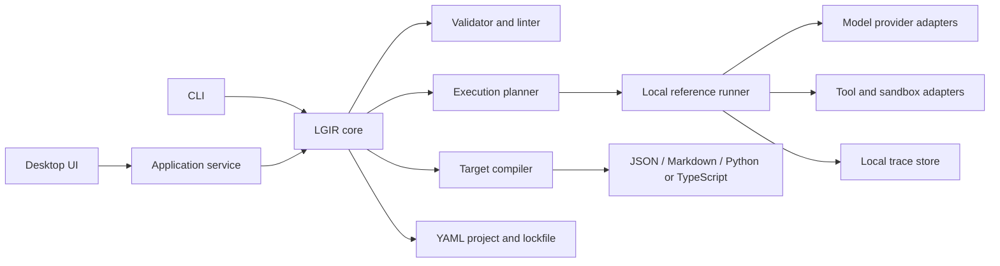
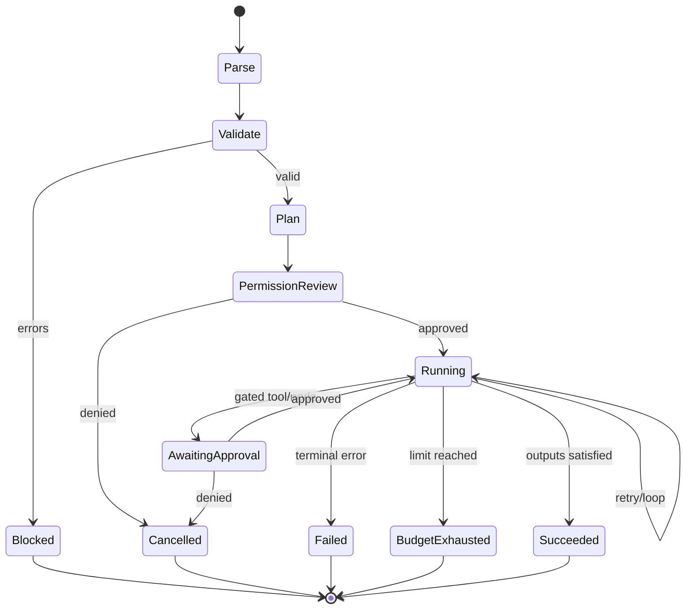

# Ladder Graph — Product and Technical Specification

**Status:** Product concept / pre-MVP  
**Date:** 2026-08-15  
**Audience:** Founders, product, design, engineering, and open-source contributors

## 1. Executive summary

Ladder Graph should be a **local-first visual compiler, runner, and debugger for portable agent workflows**.

Users compose typed agent, tool, evaluation, approval, and control-flow nodes on a visual canvas. Ladder Graph validates the workflow, runs its portable subset locally, explains target incompatibilities, and compiles it into human-readable artifacts such as JSON, Markdown, Python, TypeScript, and supported agent-framework configurations.

The product should not begin as another general-purpose automation platform or claim that every target can express every graph. Its wedge is:

> **Design once. Understand every step. Export without lock-in.**

The core strategic asset is a small, versioned **Ladder Graph Intermediate Representation (LGIR)** with explicit execution semantics. The canvas, CLI, template library, validator, reference runner, and export adapters all operate on that representation.

### Recommended product choices

| Decision | Recommendation | Reason |
|---|---|---|
| Initial user | Agent-building software engineers and applied AI researchers | They feel orchestration pain, tolerate technical concepts, and can contribute adapters and templates |
| Initial job | Turn a multi-agent design into a validated, inspectable, Git-friendly implementation | Narrower and more defensible than “build any AI app visually” |
| Execution model | DAG by default; cycles only inside structured loop containers | Makes scheduling, validation, debugging, and export tractable |
| Portability | Canonical IR plus capability-aware adapters | Direct graph-to-every-format conversion will silently lose meaning |
| Local promise | Local project storage and local orchestration by default; model/tool calls may still use configured services | “Local” must not falsely imply all inference is offline |
| Template model | Versioned capability packages with contracts and tests, not persona prompts alone | Robust reuse requires inputs, outputs, permissions, tools, and quality checks |
| Open-source model | Apache-2.0 core; optional paid collaboration/managed services later | Maximizes trust, adoption, and ecosystem contribution |
| MVP scope | Editor, validator, reference runner, trace debugger, templates, JSON/Markdown plus one executable adapter | Proves the end-to-end value without an adapter explosion |

## 2. Product critique

The original idea has a compelling user-facing object—the graph—but several assumptions need tightening.

### What is strong

- Agent work is naturally explained as roles, dependencies, decisions, and iterations.
- A visual representation can expose orchestration mistakes that are hard to spot in prompts or scattered configuration.
- Local-first, open-source, and Git-friendly behavior fits developers and researchers better than a cloud-only canvas.
- Editable, reusable node templates can compound community knowledge.
- Multiple export targets reduce framework lock-in and make the graph useful before users adopt a runtime.

### What is underspecified or risky

#### 1. “DAG graphs and loops” is contradictory without structured semantics

A DAG cannot contain cycles. If users can draw arbitrary back-edges, validation, scheduling, state management, retries, and compilation become ambiguous. The product should describe a workflow as a **DAG of nodes and structured control-flow regions**. A loop is a bounded container with its own body graph, state, exit rule, and budgets—not an unrestricted cycle.

#### 2. “Agnostic output” cannot mean lossless export to everything

JSON is an interchange format, Markdown is documentation, Python and TypeScript are executable languages, and provider-specific files have different runtime semantics. Ladder Graph should support **export targets with declared capability levels**, not promise universal equivalence. Unsupported semantics must produce an actionable compile error or an explicit approximation warning.

#### 3. Persona-first templates are too shallow

“Developer,” “tester,” and “venture capitalist” are useful labels, but a high-quality node requires more than a system prompt. It needs a purpose, input/output contract, model needs, tools, permission boundaries, failure behavior, evaluation rubric, examples, tests, version, and provenance. Templates should describe **capabilities and contracts**; persona is optional presentation.

#### 4. Visual complexity can become “node spaghetti”

Canvas products often optimize for easy node creation instead of easy graph comprehension. Ladder Graph needs subgraphs, semantic zoom, auto-layout, typed ports, edge bundling, search, a dependency outline, and linting for graph complexity. The key UX metric is not how quickly users add nodes; it is how quickly they can understand and safely change a graph.

#### 5. A hierarchical folder system is necessary but insufficient

Folders help discovery, but reusable definitions also need stable IDs, semantic versions, dependency locks, inheritance rules, integrity checks, and conflict handling. Folder location must not be identity.

#### 6. “Local, lightweight, secure, SOTA UI” is not yet a testable requirement

Each term needs observable criteria. For example: cold start under two seconds on a reference machine, no account required, no telemetry by default, secrets stored outside project files, 60 FPS pan/zoom on a 200-node graph, and complete keyboard operation for core editing.

#### 7. The market already has visual agent canvases

Langflow supports a visual component editor, testing, custom components, and generated API snippets; Flowise supports agent flows with state, conditions, loops, and human-in-the-loop; Dify combines workflows, traces, and production app delivery; and LangSmith Studio emphasizes graph inspection and debugging. These are validated user needs, but they mean “visual agent builder” is not differentiated by itself. See [Langflow](https://docs.langflow.org/concepts-overview), [Flowise Agentflow V2](https://docs.flowiseai.com/using-flowise/agentflowv2), [Dify Workflow Studio](https://dify.ai/workflows), and [LangSmith Studio](https://langchain-ai.github.io/langgraph/concepts/langgraph_studio/).

The portability wedge is especially timely: OpenAI announced that its Agent Builder would wind down on November 30, 2026 and recommended moving code-suitable workflows to its Agents SDK. A provider-independent, human-readable source of truth protects users from this class of lifecycle risk. See [OpenAI’s AgentKit update](https://openai.com/index/introducing-agentkit/).

## 3. Product vision

### Vision

Make sophisticated agent systems as understandable, testable, and portable as a well-designed software module.

### Product promise

Ladder Graph lets a user answer five questions before trusting a workflow:

1. What runs, and in what order?
2. What data and authority does each step receive?
3. Why does a branch continue, retry, or stop?
4. What did a run cost and produce?
5. What changes when the graph is exported to a particular target?

### Positioning

**For** software engineers and applied AI researchers building multi-step agent systems,  
**Ladder Graph is** a local-first visual compiler and debugger  
**that** turns agent workflows into validated, portable, Git-friendly artifacts.  
**Unlike** runtime-first visual automation suites,  
**it** keeps an open intermediate representation as the source of truth and makes target-specific loss of behavior visible before execution.

### Product principles

1. **The graph is code.** It must be diffable, reviewable, testable, versioned, and reproducible.
2. **Explicit beats magical.** Data flow, authority, state, conditions, and budgets are visible.
3. **Portable does not mean identical.** Compatibility is measured and explained.
4. **Safe by default.** Tools, secrets, network access, filesystem scope, and destructive actions use least privilege.
5. **Progressive disclosure.** A beginner can use templates; an expert can edit the underlying spec.
6. **Debugging is part of authoring.** Runs, traces, evaluations, and breakpoints are first-class.
7. **The UI never becomes the only way out.** Every project has a documented text representation and CLI path.

## 4. Users and jobs to be done

### Primary persona: agent application engineer

- Builds agentic features in Python or TypeScript.
- Currently coordinates prompts, tools, SDK calls, and retries in code.
- Needs code review, reproducible runs, trace inspection, and a path to production.

**Job:** “When a workflow grows beyond a few agent/tool calls, help me design and debug it without surrendering control of the code or runtime.”

### Secondary persona: applied AI researcher

- Compares orchestration patterns, prompts, models, and evaluator behavior.
- Needs repeatable experiments, controlled budgets, and artifacts that can be published.

**Job:** “Help me make an experiment legible and reproducible, then compare variants without rebuilding the harness.”

### Secondary persona: technical hobbyist

- Wants strong templates and a quick local start.
- Needs guardrails and understandable errors more than maximum flexibility.

**Job:** “Help me assemble a useful multi-agent workflow safely and learn how it works.”

### Explicitly not the initial customer

- Non-technical business operations teams seeking hundreds of SaaS connectors.
- Enterprises needing hosted RBAC, audit retention, SLAs, and managed deployment on day one.
- Users seeking a no-code chatbot publishing suite.

These segments can be addressed later, but targeting them in the MVP would pull the product toward a crowded automation platform.

## 5. Scope

### MVP outcomes

A new user can:

1. Install and open Ladder Graph without creating an account.
2. Start from a blank workflow or an included multi-agent template.
3. Add, connect, group, and configure typed nodes.
4. Create a bounded evaluator-driven refinement loop.
5. Validate types, dependencies, permissions, budgets, and target compatibility.
6. Run the portable subset locally with explicit approval for privileged tools.
7. Inspect the execution path, node inputs/outputs, timing, token/cost estimates, and evaluation results.
8. Export to canonical JSON, Markdown documentation, and one executable target.
9. Review the resulting project cleanly in Git.
10. Create or fork a reusable template locally.

### MVP non-goals

- A hosted workflow service or production control plane.
- Real-time multiplayer editing.
- A marketplace with unreviewed one-click executable templates.
- Hundreds of SaaS integrations.
- Arbitrary cyclic graphs or distributed scheduling.
- Lossless round-trip import from every supported export target.
- Visual prompt engineering as a substitute for evals.
- Autonomous optimization of prompts or graph structure.
- Storing credentials inside graph or template files.

## 6. Core conceptual model

### 6.1 Workflow

A workflow is a versioned LGIR document containing metadata, typed inputs and outputs, nodes, edges, structured control-flow regions, policies, test cases, and export preferences.

### 6.2 Node kinds

Keep the built-in set small and composable:

| Kind | Purpose | MVP |
|---|---|---|
| `agent` | Model-guided step with instructions and optional tools | Yes |
| `tool` | Deterministic callable with an input/output schema | Yes |
| `transform` | Deterministic data mapping or code expression | Yes, restricted |
| `condition` | Deterministic branch based on typed state | Yes |
| `evaluate` | Deterministic or model-judged quality check | Yes |
| `approval` | Human decision/checkpoint | Yes |
| `join` | Synchronizes parallel branches | Yes |
| `loop` | Structured repeated subgraph with exit policy | Yes |
| `subgraph` | Reusable nested workflow | Yes |
| `input` / `output` | Declares public workflow contract | Yes |
| `trigger` | Webhook, schedule, or event source | Later |
| `memory` / `store` | Durable shared state provider | Later |

“Developer,” “researcher,” and “critic” should be **templates of `agent`**, not new runtime kinds.

### 6.3 Edges and ports

Every connection is explicit and typed:

- **Data edge:** maps a named output port to a compatible input port.
- **Dependency edge:** declares completion order when no data is transferred.
- **Control edge:** represents a condition outcome or loop transition and is created by a control-flow node.

The UI must visually distinguish these without relying on color alone. A node becomes runnable only when all required inputs are resolved and its dependency/control gates are satisfied.

### 6.4 Parallelism and joins

Ready sibling nodes run in parallel up to a project concurrency limit. A `join` declares one of:

- `all`: wait for all inbound branches.
- `any`: continue after the first successful branch and optionally cancel the rest.
- `quorum(n)`: continue after `n` successful branches; post-MVP unless demanded by users.

Implicit parallelism is displayed in the run preview so users are not surprised by cost or side effects.

### 6.5 Structured loops

Arbitrary back-edges are invalid. A loop owns a nested body graph and must define:

- Initial typed state.
- Body inputs and outputs.
- Continue/exit condition.
- Maximum iterations, always finite.
- At least one additional budget: wall time, tokens, or cost.
- Behavior on evaluator failure, node error, cancellation, and budget exhaustion.
- Which state is carried to the next iteration.
- Final output selection.

An evaluator-driven refinement loop might mean: draft → critique → revise → evaluate; exit when score ≥ 0.85, otherwise continue for at most three iterations and $1.00.

### 6.6 Evaluations

Evaluation is a contract, not a decorative score. An evaluator declares:

- Input artifact and rubric.
- Deterministic, model-judge, or human evaluation mode.
- Structured result schema, such as `{score, passed, reasons, evidence}`.
- Threshold and invalid-result behavior.
- Model and sampling configuration when applicable.
- Whether the result is advisory, a branch gate, a loop exit, or a workflow failure.

Model-judge outputs must be labeled probabilistic. Ladder Graph should encourage multiple test cases and should not present one judge result as ground truth.

### 6.7 State

Prefer immutable node outputs and explicit mappings. Workflow-scoped mutable state should be minimal and namespaced. Hidden global conversational state makes graphs hard to reproduce and export.

### 6.8 Errors, retries, and cancellation

Each executable node can set:

- Timeout.
- Retry count and exponential backoff.
- Retryable error classes.
- Idempotency requirement for side-effecting tools.
- On-error behavior: fail, skip, emit fallback, request approval, or route to an error output.

Retries count against budgets and appear as distinct trace attempts. Cancellation propagates to descendants and records any side effects that may have completed.

## 7. Template system

### Template definition

A template is a versioned package that can instantiate a node or subgraph. It includes:

- Stable package ID and semantic version.
- Display name, purpose, tags, maturity, author, license, and provenance.
- Node kind and LGIR compatibility range.
- Typed inputs and outputs.
- Editable instructions with documented variables.
- Required and optional tools/skills.
- Default model capabilities rather than a hard-coded provider where possible.
- Permission manifest.
- Timeout, retry, and budget defaults.
- Evaluation rubric and example test cases.
- README, changelog, and migration notes.
- Integrity hash and optional signature.

### Template behavior

- **Pin by default:** an instantiated template records the exact version and integrity hash.
- **Fork explicitly:** local changes create an embedded fork unless the user chooses to track upstream.
- **Update visibly:** upgrading shows a semantic diff of prompts, schemas, permissions, tools, and tests.
- **No ambient authority:** adding a template never grants filesystem, shell, network, or credential access automatically.
- **Composable inheritance:** allow one `extends` relationship with explicit overrides; avoid deep inheritance chains.

### Suggested built-in templates

Ship fewer, better templates tied to complete workflows:

- Implementation agent with scoped workspace tools.
- Test author and test runner pair.
- Evidence-backed researcher with citation contract.
- Critic/evaluator with structured rubric.
- Product brief reviewer.
- GTM hypothesis reviewer.
- Human approval checkpoint.
- Parallel research and synthesis subgraph.
- Draft–critique–revise loop.

Templates such as “venture capitalist” or “mathematician” can exist in the community library, but they should not dominate the first-run experience unless attached to a clear job and evaluated output.

### Local package layout

```text
my-ladder-project/
├── ladder.project.yaml
├── graphs/
│   └── feature-delivery.ladder.yaml
├── templates/
│   └── local/
│       └── product-reviewer/
│           ├── template.yaml
│           ├── prompt.md
│           ├── README.md
│           ├── CHANGELOG.md
│           └── tests/
├── tests/
│   └── feature-delivery.cases.yaml
├── fixtures/
├── exports/                 # Generated; normally ignored or checked in intentionally
├── runs/                    # Local traces; ignored by default
├── ladder.lock
└── .gitignore
```

Folder location is for organization. Identity comes from package ID + version + integrity hash.

## 8. LGIR and export model

### Canonical source of truth

Use a human-readable YAML authoring format with a normative JSON Schema. Parse it into an in-memory canonical IR, then emit normalized JSON for tools and adapters. YAML comments may be preserved as authoring metadata but should not affect execution.

Example, illustrative rather than final syntax:

```yaml
apiVersion: ladder.dev/v1alpha1
kind: Workflow
metadata:
  id: feature-delivery
  name: Feature delivery review
spec:
  inputs:
    brief: { type: string }
  nodes:
    - id: implement
      kind: agent
      uses: ladder.dev/templates/implementation-agent@1.2.0
      inputs:
        task: $workflow.inputs.brief
      permissions:
        filesystem: workspace-write
        network: deny
      outputs:
        patch: { type: artifact.diff }
    - id: review
      kind: evaluate
      uses: ladder.dev/templates/code-reviewer@1.1.0
      inputs:
        candidate: $nodes.implement.outputs.patch
  edges:
    - from: implement.patch
      to: review.candidate
  outputs:
    result: $nodes.implement.outputs.patch
```

### Adapter capability contract

Each target declares support as `native`, `emulated`, `documentation-only`, or `unsupported` for:

- Typed data edges.
- Parallel execution and joins.
- Structured loops.
- Human approval/checkpoint resume.
- Tool permission enforcement.
- Retries and idempotency.
- Durable state.
- Evaluation gates.
- Subgraphs.
- Trace metadata.

Compilation rules:

1. `unsupported` used by the graph is a compile error.
2. `emulated` is allowed only with a visible warning and generated explanation.
3. The export includes a manifest with source graph hash, adapter version, capability report, and generation timestamp.
4. Generated files contain stable node IDs so traces can map back to the canvas.
5. Export is one-way in the MVP. Round-trip editing is not promised.

### Recommended first targets

1. **LGIR JSON:** exact machine-readable interchange.
2. **Markdown:** architecture, node contracts, Mermaid diagram, risks, and compatibility report.
3. **One executable target:** choose Python or TypeScript after design-partner interviews; Python is the likely research wedge, TypeScript the likely desktop/full-stack wedge.
4. **Provider/framework adapters:** add only when a maintainer and contract-test suite exist.

“Codex-specific” and “Claude-specific” should be narrowly named packages or workspace artifacts, not vague formats. Their adapters must define exactly which product surface and version they target.

## 9. UX specification

### 9.1 Information architecture

Use a five-region desktop layout:

```text
┌──────────────────────────────────────────────────────────────────────────┐
│ Project / Graph     Validate     Run     Target: Python     Export       │
├──────────────┬─────────────────────────────────────┬─────────────────────┤
│ Library      │                                     │ Inspector           │
│ - Nodes      │              Canvas                 │ - Contract          │
│ - Templates  │                                     │ - Prompt            │
│ - Subgraphs  │                                     │ - Tools/skills      │
│ - Search     │                                     │ - Permissions       │
│              │                                     │ - Retry/budget      │
├──────────────┴─────────────────────────────────────┴─────────────────────┤
│ Problems / Run trace / Output / Compatibility / Tests                   │
└──────────────────────────────────────────────────────────────────────────┘
```

The canvas is the spatial overview, not the only editor. Users must also have an outline/tree, problems list, and source view.

### 9.2 Primary authoring journey

1. **Start:** choose “Blank,” “Draft–critique–revise,” or “Parallel implementation review.”
2. **Define contract:** enter workflow inputs, expected outputs, and budget before adding many nodes.
3. **Compose:** drag a template or use command search; compatible ports highlight.
4. **Configure:** inspector begins with purpose and contract, then prompt, capabilities, safety, and advanced runtime settings.
5. **Validate continuously:** errors appear on the node and in the Problems panel with a one-click focus action.
6. **Preview execution:** show parallel groups, approvals, loops, and estimated maximum calls/cost.
7. **Run:** choose test input, review requested permissions, and stream node status.
8. **Debug:** click a trace step to inspect normalized inputs/outputs, tool calls, attempts, evaluator evidence, and budget use.
9. **Compile:** choose a target and resolve capability errors.
10. **Export:** preview the file diff before writing generated artifacts.

Target: a competent developer can modify an included workflow, run it, understand one failure, and export it within ten minutes.

### 9.3 Canvas behavior

- Typed input ports on the left and output ports on the right.
- Edge labels shown on selection or when ambiguity exists.
- Containers for loops and subgraphs; groups are not merely visual rectangles.
- Semantic zoom: overview shows names/status; close zoom reveals ports and key settings.
- Auto-layout by execution rank with user pinning.
- Minimap only for large graphs; dependency outline is often more useful.
- Search by node, template, tool, variable, error, or permission.
- Command palette for all creation and navigation actions.
- Multi-select, align, distribute, duplicate, extract subgraph, and disable.
- Copy/paste preserves stable local references and warns about missing templates.
- Complexity lints: crossing count, unlabeled conditions, long edges, excessive fan-out, nested-loop depth, and orphan nodes.
- No color-only meaning; shapes, icons, labels, and line styles reinforce state.

### 9.4 Progressive disclosure

The default inspector shows:

- Purpose.
- Inputs and outputs.
- Instructions.
- Tools/skills.
- Model capability.
- Permission summary.

Advanced sections reveal provider overrides, retry policy, cache, concurrency, raw schema, adapter hints, and tracing. A source panel always exposes the underlying definition and highlights the selected node.

### 9.5 Run and debug UX

Run states: queued, blocked, awaiting approval, running, retrying, passed, failed, skipped, cancelled, and budget-exhausted.

The timeline should answer “why did this run?” and “why did it stop?” Clicking an edge reveals the value mapping or branch condition. Loop iterations are stacked and collapsible rather than duplicated across the canvas.

Support:

- Breakpoint before/after a node.
- Run from selected node using recorded or fixture inputs.
- Re-run failed node when safe.
- Compare two runs by path, output, evaluator score, latency, and cost.
- Redaction of secret values and configured sensitive fields.
- Exportable trace summary without hidden chain-of-thought. Preserve observable tool calls, decisions, structured results, and concise model-provided summaries.

### 9.6 Accessibility and performance

- Core graph construction and configuration are keyboard operable.
- Visible focus, logical tab order, screen-reader labels, reduced-motion mode, and WCAG AA contrast.
- Text equivalents exist for graph relationships through the outline and source views.
- Pan/zoom should remain responsive at 200 nodes and 400 edges on the reference machine.
- Large graphs use viewport virtualization and incremental layout.
- Autosave is crash-safe and never blocks canvas interaction.

## 10. System architecture

### Recommended shape

Use a **functional core, imperative shell** architecture. Parsing, normalization, validation, scheduling decisions, and compilation are deterministic libraries. UI, model providers, tools, filesystem access, and process execution are adapters around that core.



### Suggested implementation stack

| Layer | Recommendation | Notes |
|---|---|---|
| Desktop shell | Tauri 2 | Smaller distribution and tighter native capability surface than Electron; validate contributor ergonomics early |
| UI | React + TypeScript | Strong graph-editor ecosystem and familiar contributor base |
| Canvas | React Flow/Xyflow plus ELK layout | Do not couple domain semantics to the canvas library’s serialization |
| Core engine | Rust library exposed to desktop and CLI | Strong fit for deterministic validation, portability, and small binaries; TypeScript is a lower-friction fallback for a small founding team |
| Schemas | JSON Schema generated/validated from canonical types | Enables editor validation and adapter contract tests |
| Project storage | YAML + lockfile on filesystem | Git-native and inspectable |
| Local metadata | SQLite | Recent projects, run index, caches, and search; projects remain portable without it |
| Trace payloads | Content-addressed blobs + SQLite index | Avoid bloating the canonical graph file |
| IPC | Narrow typed commands/events | Treat renderer input as untrusted; no generic shell bridge |

The team should choose Rust only if it can support it well. A clean TypeScript core with strict boundaries is better than an under-maintained multi-language architecture.

### Core modules

1. **Parser/normalizer:** validates schema version, resolves template references, applies defaults, and produces canonical LGIR.
2. **Semantic validator:** checks types, reachability, ports, cycles, loop bounds, budgets, permissions, joins, variable references, and target capabilities.
3. **Planner:** computes readiness, parallel groups, approval gates, and worst-case call/budget bounds.
4. **Reference runner:** executes core primitives locally through provider/tool interfaces.
5. **Trace service:** records events, attempts, state references, approvals, timing, and usage with redaction.
6. **Compiler SDK:** capability negotiation, diagnostics, source maps, and deterministic file emission.
7. **Template registry:** local resolution, version locking, integrity verification, search, update diff, and migrations.
8. **Project service:** atomic writes, file watching, Git-aware change detection, and merge-conflict surfacing.

### Execution lifecycle



### Plugin and adapter boundary

Run third-party adapters out of process with a versioned protocol. A plugin declares:

- Protocol and LGIR version ranges.
- Capabilities.
- Requested filesystem/network/process permissions.
- Commands and generated-file ownership.
- Package identity, license, integrity, and signature status.

The app must not load arbitrary native code into its privileged process. Initially, prefer declarative templates and a reviewed adapter SDK over a broad plugin marketplace.

## 11. Security and privacy

### Threat model

Assume graphs, prompts, model outputs, imported templates, MCP/tool descriptions, project files, and generated code may be malicious or compromised. Assume a model can be prompt-injected into requesting tools outside the user’s intent.

### Security requirements

1. **No secrets in project files.** Store credential references, not values; use OS keychain integration where available.
2. **Deny by default.** Filesystem, network, process, clipboard, and external-app access require declared scopes.
3. **Approval at the authority boundary.** A model asking to use a tool is not authorization. High-impact or newly expanded actions require user approval.
4. **Sandbox tool execution.** Separate orchestration from model-generated code/process execution. OpenAI’s current Agents SDK guidance similarly recommends separating the agent harness from compute to keep credentials out of execution environments; see [The next evolution of the Agents SDK](https://openai.com/index/the-next-evolution-of-the-agents-sdk/).
5. **Taint untrusted content.** Track external/model-derived values and warn when they flow into shell, code, filesystem paths, network destinations, or approval text.
6. **Redact traces.** Secret fields and user-configured sensitive data are redacted before persistence or export.
7. **No telemetry by default.** Any analytics are opt-in, documented, inspectable, and removable.
8. **Atomic, scoped writes.** Export preview lists exact paths and diffs. Adapters cannot write outside approved roots.
9. **Template supply-chain controls.** Lock versions and hashes; show signatures, provenance, requested permissions, and update diffs.
10. **Security log.** Record permission requests, approvals, denials, scope expansion, tool calls, and generated-file writes.

### Local-first definition

- Account-free use.
- Project definitions and run traces stored locally by default.
- No hidden cloud sync.
- Users may configure local or hosted model providers.
- Every run preview clearly identifies which nodes can transmit data off-device.
- A “strict offline” mode blocks network adapters and validates that the selected workflow can operate without them.

## 12. Reliability and testing

### Test layers

- JSON Schema and parser fixtures for every LGIR version.
- Property tests for graph validation and scheduler invariants.
- Golden-file tests for deterministic exports.
- Adapter capability contract tests.
- Loop tests covering exit, bound exhaustion, cancellation, retry, and nested subgraphs.
- Permission tests proving undeclared access fails closed.
- Crash/recovery tests for atomic saves and resumable approvals.
- UI interaction tests for keyboard graph authoring and trace navigation.
- Performance fixtures at 50, 200, and 1,000 nodes; 1,000-node support can be view-only in the MVP.

### Reproducibility record

Each run captures:

- Source graph and lockfile hashes.
- Ladder Graph and adapter versions.
- Template versions.
- Model/provider identifiers and user-visible sampling configuration.
- Tool versions where detectable.
- Input fixture hash.
- Permissions granted.
- Budgets and usage.

Reproducibility does not imply identical stochastic model output; the UI must distinguish configuration reproducibility from output determinism.

## 13. GTM strategy

### Beachhead

Target developers already building multi-agent workflows in code who experience one of these moments:

- A second or third agent makes execution order hard to reason about.
- An evaluator/refinement loop becomes fragile.
- A team needs to review prompts, tools, and permissions together.
- A workflow must move between frameworks or survive a provider change.
- A research graph needs to be published and reproduced.

Do not lead with “no-code.” Lead with **portable architecture, visual debugging, and Git-native control**.

### Message hierarchy

1. **Design once, export without lock-in.**
2. **See exactly why an agent ran, retried, or stopped.**
3. **Keep workflows local, reviewable, and safe by default.**
4. **Start with expert templates; own every prompt and permission.**

### Launch artifacts

- A 90-second demo of draft → critique → bounded revision → export.
- Three excellent example repositories, each with graph source, generated code, tests, and trace screenshots.
- “Build the same workflow in Python and TypeScript” technical article.
- Adapter authoring guide and contract-test starter.
- Security model and local-first data-flow page.
- Honest compatibility matrix.
- Benchmark showing graph size, startup time, export determinism, and run overhead—not model-quality theater.

### Distribution

- GitHub README and release artifacts are the primary acquisition surface.
- Launch to agent-framework, local-first, developer-tool, and applied-AI communities with working examples.
- Partner with maintainers for adapters rather than advertising unsupported compatibility.
- Publish template packs around concrete outcomes: code review, research synthesis, product critique, and eval-driven refinement.
- Make every exported Markdown artifact include an optional, unobtrusive “Designed with Ladder Graph” link.

### Open-source and business model

Recommended sequence:

1. Apache-2.0 desktop app, CLI, LGIR, core templates, reference runner, and adapter SDK.
2. Sponsorships and paid support during early adoption.
3. Optional paid team product only after evidence of demand: shared registries, signed private templates, policy packs, centralized secrets, run comparison, and managed execution.

Never degrade local export or core portability to force cloud conversion. The open format and compiler are the trust anchor.

## 14. Metrics

### North-star metric

**Weekly successful graph activations:** distinct users who validate and then either complete a run or export an executable artifact from a graph with at least three executable nodes.

This measures realized value better than graph creation or node count.

### Activation funnel

| Stage | Metric | Initial target |
|---|---|---|
| Install | App reaches ready state | ≥ 90% of launches with supported OS |
| First value | Included graph validates | ≥ 70% of first sessions |
| Core activation | First run or executable export | ≥ 40% of first sessions |
| Understanding | User opens trace/compatibility detail | ≥ 50% of activated sessions |
| Return | Activated user returns within 14 days | ≥ 25% |
| Ecosystem | Installs or authors a non-core template/adapter | Track after v0.2 |

Targets are hypotheses until baseline data exists. Collect only with opt-in telemetry; otherwise provide a local metrics summary that design partners can choose to share.

### Quality and guardrail metrics

- Validation errors resolved per session.
- Export success rate by adapter and LGIR version.
- Percentage of exports with warnings.
- Time from graph open to first actionable diagnostic.
- Crash-free sessions.
- Permission denials and scope-expansion frequency.
- Runs stopped by loop/cost/time bounds.
- P50/P95 canvas interaction latency at reference graph sizes.
- Template update failures and supply-chain verification failures.

## 15. Roadmap

### Phase 0 — problem validation, 3–4 weeks

- Interview 12–15 agent engineers/researchers using real workflow artifacts.
- Test the “portable visual compiler/debugger” positioning against “visual builder.”
- Prototype three workflows on paper or in a clickable canvas.
- Define LGIR semantics and capability matrix before choosing a UI library.
- Select the first executable adapter based on actual design-partner usage.

**Exit:** at least five users provide a real workflow and three agree to use an alpha on an active project.

### Phase 1 — vertical alpha, 8–12 weeks

- Local project creation and YAML/source synchronization.
- Canvas, outline, inspector, Problems panel, and continuous validation.
- Core nodes: input/output, agent, tool, condition, evaluate, approval, join, loop, and subgraph.
- Local template resolution and lockfile.
- Reference runner for a deliberately small portable subset.
- Trace timeline, permission review, loop/cost bounds.
- JSON, Markdown, and one executable adapter.

**Exit:** five design partners independently build or port a useful 5–15 node graph and resolve a failure using the trace.

### Phase 2 — public developer preview

- Adapter SDK and contract-test harness.
- Graph/test fixtures and run comparison.
- Template fork/update/diff UX.
- Packaging for macOS, Windows, and Linux.
- Accessibility and 200-node performance pass.
- Security review and threat-model publication.
- Example repositories and documentation.

**Exit:** 30% of weekly activated users return within four weeks, and at least three external contributors ship a template or adapter contribution.

### Phase 3 — ecosystem and teams, evidence-dependent

- Signed remote registries.
- Policy packs and organization defaults.
- Shared/private template catalogs.
- Optional managed collaboration and execution.
- Additional adapters with named maintainers.

Do not build Phase 3 from investor expectation alone; require repeated user pull.

## 16. MVP acceptance criteria

The MVP is ready for a public developer preview when:

- A graph with two parallel agents, a join, evaluator, bounded refinement loop, and approval node can be authored without editing raw YAML.
- The same graph round-trips between canvas and canonical YAML without semantic drift.
- Invalid arbitrary cycles, missing inputs, incompatible ports, unbounded loops, unresolved templates, and undeclared permissions are caught before execution.
- The run preview shows maximum loop iterations, concurrency, permissions, and available budget estimate.
- A failed run can be traced to the exact node attempt and source definition.
- Exports are deterministic for the same normalized source, lockfile, and adapter version.
- The executable adapter’s unsupported features fail with specific remediation guidance.
- No secret value appears in project files, logs, traces, export previews, or crash reports in the security test suite.
- The app works without an account and makes no network request before the user configures or invokes a networked capability.
- A 200-node reference graph remains readable and responsive using canvas plus outline navigation.

## 17. Key risks and mitigations

| Risk | Consequence | Mitigation |
|---|---|---|
| Category is crowded | Product is dismissed as another node editor | Own portability, compiler diagnostics, local trust, and Git workflow |
| Lowest-common-denominator IR | Exports are portable but weak | Small portable core plus namespaced target extensions; show portability score |
| Adapter maintenance explosion | Broken exports erode trust | One adapter first, capability contracts, named maintainers, golden tests |
| Visual spaghetti | Large graphs become less understandable than code | Structured loops/subgraphs, outline, auto-layout, complexity linting, semantic zoom |
| Prompt templates become gimmicks | Library has quantity without quality | Contract/test requirements, maturity labels, provenance, curated core |
| Arbitrary code compromises local machine | Severe trust failure | Out-of-process tools, least privilege, sandbox interface, approval, taint warnings |
| Model non-determinism undermines debugging | Users cannot reproduce failures | Config hashes, fixtures, recorded outputs, run comparison, honest semantics |
| Rust slows a small team | Architecture delays product learning | Time-box spike; use TypeScript core if it materially improves iteration speed |
| Open-source project lacks revenue | Maintenance becomes unsustainable | Paid support first; team registry/policy/managed services only after demand |
| Name is confused with a graph-theory term | Search and comprehension suffer | Always use descriptor: “Ladder Graph — portable agent workflow IDE”; test name early |

## 18. Decisions still requiring user research

1. Is the primary wedge design/export, or local run/debug?
2. Which first executable target produces the strongest pull: Python, TypeScript, or a specific agent SDK?
3. Do users think in agent roles, tasks, artifacts, or state transitions when sketching workflows?
4. Which permissions and approvals are acceptable before the safety UX feels burdensome?
5. Do researchers require notebook export in the first release?
6. How often do real graphs need arbitrary cycles versus structured loops?
7. Should source YAML be the default visible authoring format, or should normalized JSON be canonical on disk?
8. Will users contribute adapters under Apache-2.0, or do framework vendors need a separate compatibility program?
9. Does “Ladder Graph” communicate progress and orchestration, or create avoidable confusion?

## 19. Recommended next product test

Build one narrow vertical prototype around this graph:

> Input brief → parallel implementer and risk reviewer → join → critic/evaluator → bounded revision loop → human approval → Markdown and executable export.

Put it in front of five developers with one task: “Change the exit threshold, find why the second run stopped, and export it to your preferred language.” Measure completion time, errors, and where they switch to source view. This test simultaneously validates the graph semantics, inspector hierarchy, trace UX, template model, and portability promise.

If that workflow is not materially easier to understand and modify than a small code implementation, the product should narrow further before building a broader node library.
